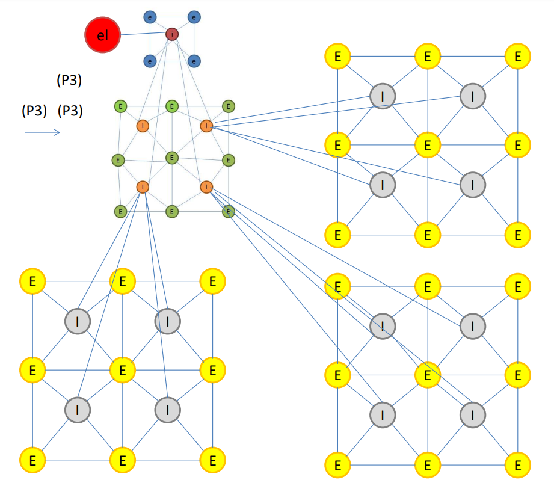

# Generation and visualization of a quadrangular mesh grammar

This is a group project for the 'Graph grammars' class. The goal of this project is to develop a program that generates and visualizes the follwing mesh:

## Working with the repo

### Create virtual environment

- `python -m pip install venv`
- `python -m venv env`

#### Windows

- `env/Scripts/activate.ps1` for powershell
- `env/Scripts/activate.bat` for cmd

#### Linux

- `source env/bin/activate` in bash

### Install required packages

- `python -m pip install -r requirements.txt`

### Run the example script to validate the environment

- `python main.py`

### Run the tests

- `python -m pytest`
